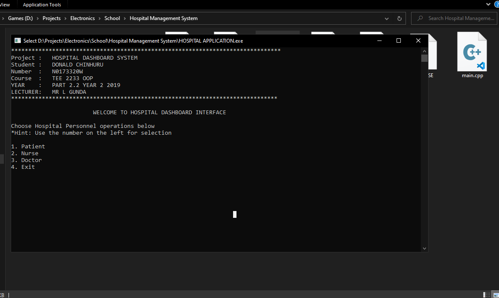
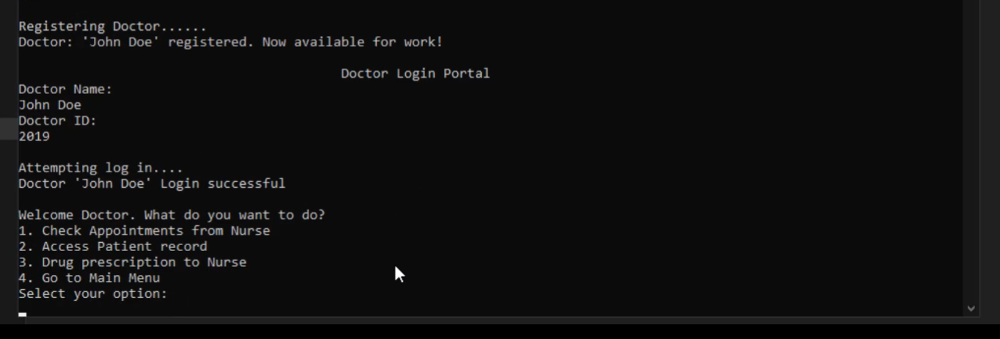
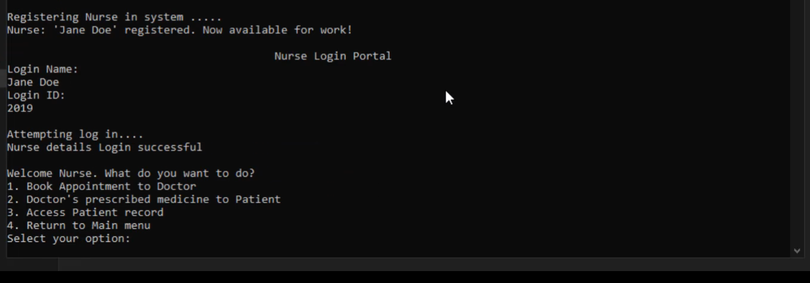

# Hospital Management System
- Once a school C++ OOP project

```
@project: 		A C++ project of choice using concepts of OOP
@course:		C++ OOP
@year:			2019
@program:		Electronic Engineering, Second Year Part 2.2
```

## Concept
- Hospital Management System were patient data is logged to the system
- Nurse registers | log in to view patient sick report, book an appointment to the Doctor in charge, and prescribe medicine to patient
- Doctor registers | log in to view patient sick report, prescribe medicine to patient, view appointments if any from the Nurse.
- The system should persist selected menu options without automatically closing the application.
- Patient sick report should be accessible during and after re-opening application

### Lessons learnt
- OOP concepts
- File I/O
- Windows system
- C++

### [Demo](demo/)
  - working demo
  
- ///////////////////////////////////////////////////////





### Credits
- My lecturer
- [University](https://www.nust.ac.zw)

### Note
- Please leave a `STAR 🌟 | FORK 🍴` if you find this useful
- If there are errors, debug it..(i even forgot how it works now 🥱)